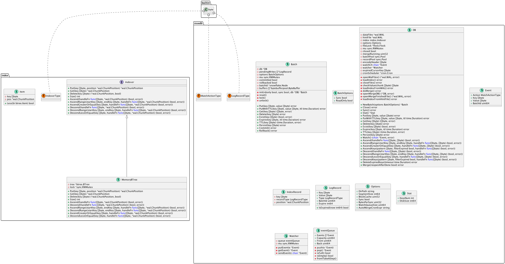

# zoom
对外提供HTTP服务，实现KV内存存储，参考rosedb实现。实践极客时间的《Go 语言项目开发实战》,包括但不限于：
- 规范设计
- 目录结构设计
- 工作流设计
- 研发流程设计
- 设计方法
- 设计模式
- API风格（RESTful、RPC）
- 项目管理 makefile
- 代码检查
- API文档
- 错误码管理
- 日志库
- 命令行输入、配置文档
- 单元测试
- CI/CD
- 容器化

微服务体系应用
- 限流
- 熔断
- 降级
- 隔离
- 负载均衡
- failover

## 文档备注
[project-layout](https://github.com/golang-standards/project-layout)

生成swagger API文档 推送到在线文档。

## TODO
前置需要去了解的组建
- [x] caron
- [ ] VIPER
- [x] gin

### 功能模块
- [ ] KV存储
- [ ] HTTP 服务
- [ ] 权限管理
- [ ] 日志管理
- [ ] web ui
- [ ] cli

## 功能特性
## 软件架构
## 快速开始
### 依赖检查
### 构建
### 运行
### 使用说明
### 如何贡献
## 社区
## 关于作者
## 谁在用
## 许可证
